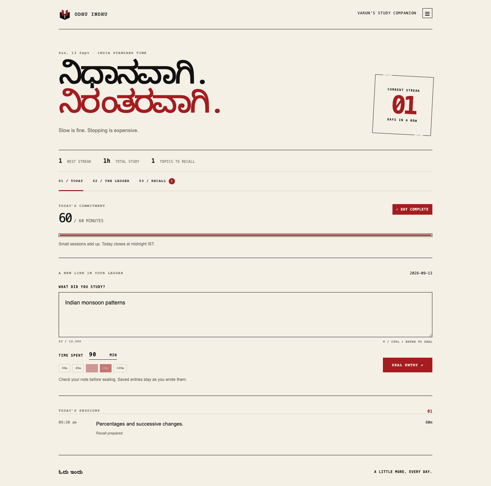
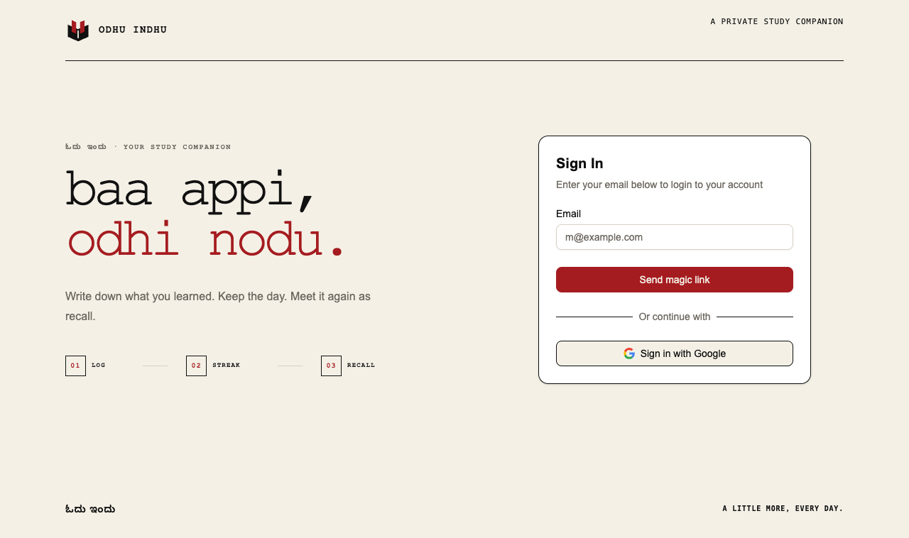
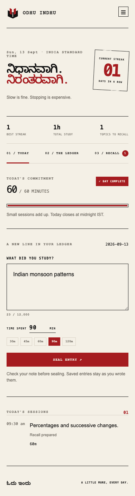

# Odhu Indhu

**ಓದು ಇಂದು. A little more, every day.**

Odhu Indhu is a quiet study companion built for Varun's SSC CGL preparation. The idea is simple: write down what you studied, complete an honest hour, and return tomorrow. The app turns those ordinary days into a visible streak and, after a little distance, into useful recall.



## What makes it different

- **The streak is the product.** Multiple sessions add up across an IST calendar day. Sixty minutes keeps the streak alive.
- **Entries are honest records.** A sealed study note cannot be edited, even directly through the application API.
- **Recall waits.** It stays hidden until the student has used the app on two different days. A topic studied today opens as a quiz two calendar days later.
- **Questions begin with evidence.** Parallel finds reliable sources, then Sarvam generates and critiques ten MCQs for every parsed topic.
- **The interface has its own voice.** Forty Kannada and English messages rotate daily without repeating inside a cycle.
- **Answers stay private until submission.** The review then explains the right answer, every distractor, and the sources used.

## The experience

1. Sign in with Google or a passwordless Magic Link.
2. Write what you studied and enter the time spent.
3. Build the daily streak while questions are prepared quietly in the background.
4. Return later for Recall, submit the quiz, and review every answer.

<details>
<summary>See sign-in and mobile screens</summary>





</details>

## Run it locally

You need Node.js 20 or newer, a Neon Postgres project with Neon Auth, and Sarvam and Parallel API access.

```sh
npm install
cp .env.example .env.local
npm run db:migrate
npm run dev
```

Enable Google and Magic Link in Neon Auth, leave password credentials disabled, then open [localhost:3000](http://localhost:3000).

The main environment values are `DATABASE_URL`, `NEON_AUTH_BASE_URL`, `CRON_SECRET`, `SARVAM_API_KEY`, and `PARALLEL_API_KEY`. Neon's Vercel integration may provide the Auth URL as `DATABASE_NEON_AUTH_BASE_URL`; the app accepts that name too.

## Built with

Next.js 16, React 19, TypeScript, Neon Postgres, Neon Auth, Sarvam, Parallel Search, Zod and Playwright. It is designed for Vercel and includes a daily recovery cron for unfinished question preparation.

## Read further

- [Project guide](docs/PROJECT_GUIDE.md) covers setup, deployment, security, data ownership, the AI pipeline and verification.
- [Implementation plan](docs/IMPLEMENTATION_PLAN.md) preserves the original architecture and longer-term ideas.
- [Brand notes](assets/brand/README.md) explain the visual mark and source assets.

## Verify it

```sh
npm run lint
npm test
npm run build
npm run test:browser
```

The suite covers IST date boundaries, streak rules, immutable entries, delayed Recall, answer redaction, CSV safety, authentication presentation, and desktop and mobile interaction.
